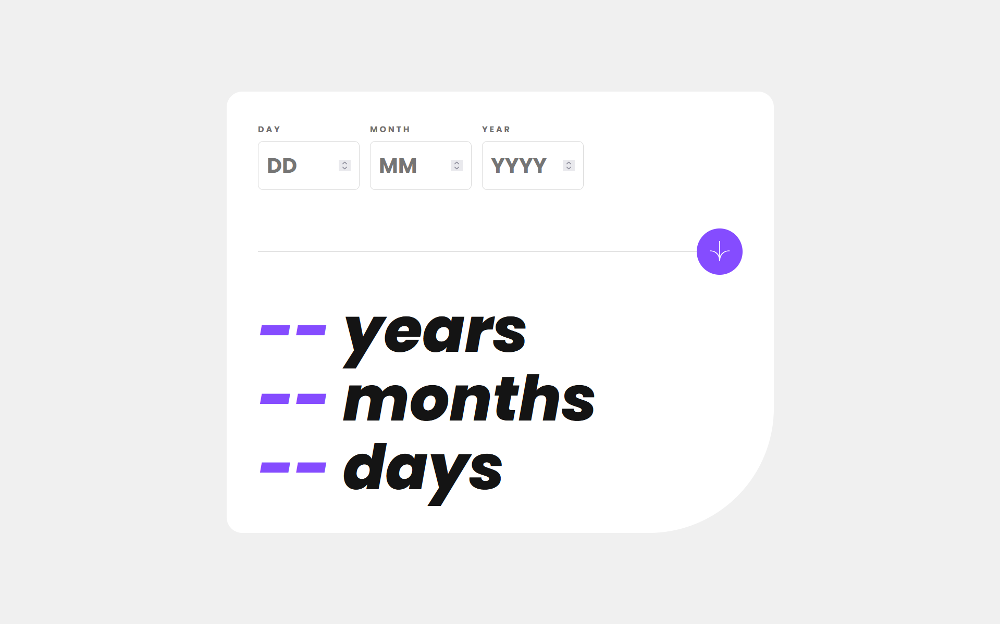
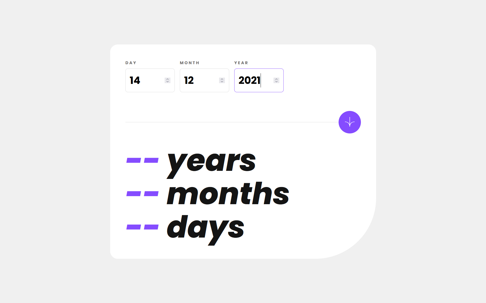
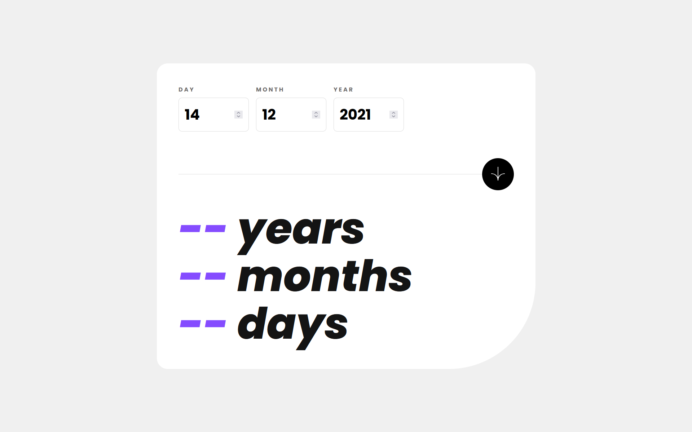
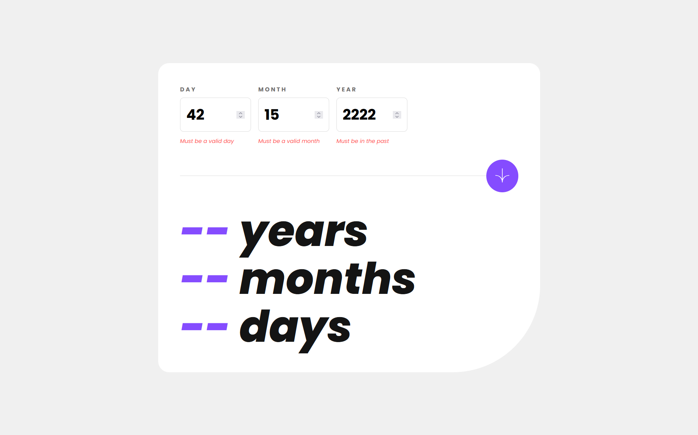
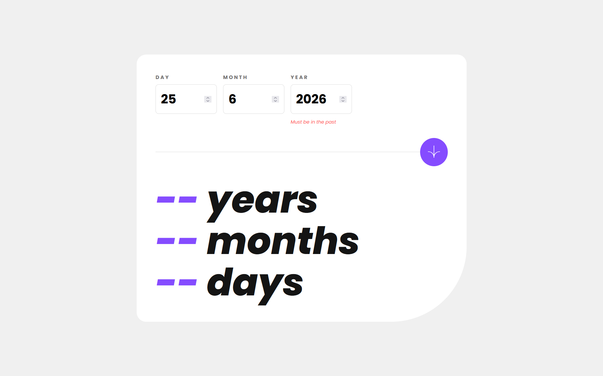
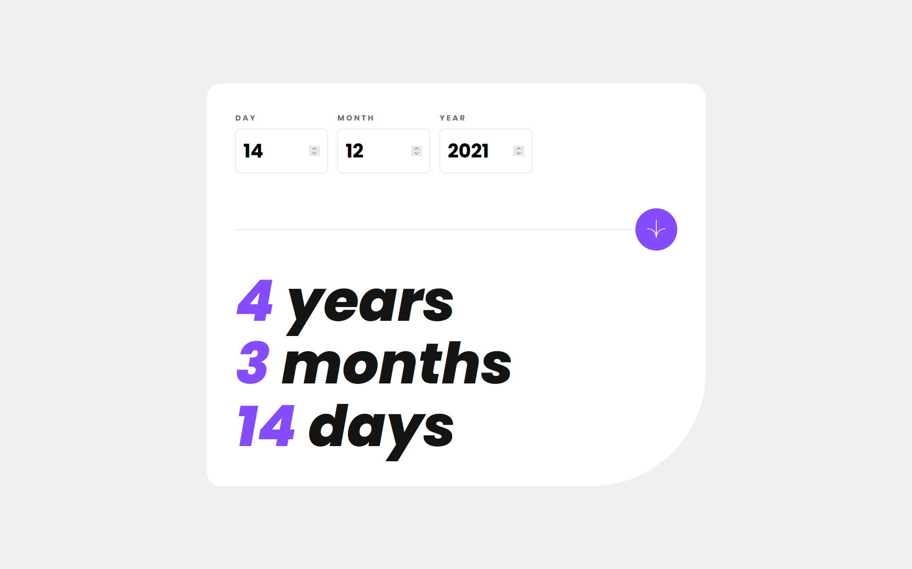

# Frontend Mentor - Age calculator app solution

This is a solution to the [Age calculator app challenge on Frontend Mentor](https://www.frontendmentor.io/challenges/age-calculator-app-dF9DFFpj-Q).

## Table of contents

- [Overview](#overview)
    - [The challenge](#the-challenge)
    - [Screenshot](#screenshot)
    - [Links](#links)
- [My process](#my-process)
    - [Built with](#built-with)
    - [What I learned](#what-i-learned)
    - [Continued development](#continued-development)
    - [AI Collaboration](#ai-collaboration)
- [Author](#author)

## Overview

### The challenge

Users should be able to:

- View an age in years, months, and days after submitting a valid date through the form
- Receive validation errors if:
    - Any field is empty when the form is submitted
    - The day number is not between 1-31
    - The month number is not between 1-12
    - The year is in the future
    - The date is invalid e.g. 31/04/1991 (there are 30 days in April)
- View the optimal layout for the interface depending on their device's screen size
- See hover and focus states for all interactive elements on the page
- **Bonus**: See the age numbers animate to their final number when the form is submitted

### Screenshot

### Links

- Live Site - GitHub Pages: [Live Site Link](https://cankutay3104.github.io/Frontend-Projects/AgeCalculatorApp/)
- FrontendMentor Solution: [Solution Link](https://www.frontendmentor.io/solutions/age-calculator-app-solution-Tx_gpMaalY)

## My process

### Built with

- Semantic HTML5 markup
- CSS custom properties
- Flexbox
- CSS Grid
- Vanilla JavaScript Logic:

    Manual Date Validation: Custom-built logic for month lengths and boundary checks.

    Leap Year Algorithm: Mathematical implementation of the Gregorian leap year rule.

    The "Borrowing" Algorithm: A manual long-subtraction approach for precise date arithmetic.

    High-Resolution Timers: Using requestAnimationFrame for hardware-accelerated number ticking.

### What I learned

The Borrowing Logic
One of the biggest challenges was calculating the difference between two dates without using a library. I implemented a "borrowing" algorithm similar to manual long subtraction. If the current day was less than the birth day, I "borrowed" days from the previous month.

Mathematical Leap Year Precision
Instead of hardcoding February to 28 days, I implemented the formal leap year check to ensure the app remains accurate across centuries.
IsLeapYear = (Year(mod4) = 0 ∧ Year(mod100) != 0) ∨ (Year(mod400) = 0)

### Continued development

I want to dive deeper into Asynchronous JavaScript and UI State Management from this point onwards. Building the "Number Tick" animation using requestAnimationFrame was my first introduction to frame-by-frame updates and the browser's render cycle. I plan to explore how modern frameworks like React handle these "side effects" more efficiently and how to implement easing functions to make animations feel more natural.

### AI Collaboration

I used the help of Gemini in this project. Rather than providing direct solutions, the AI acted as a technical mentor—providing hints, challenging my initial logic, and helping me debug the problems of my application. This collaboration was instrumental in helping me understand complex concepts like linear interpolation for animations and asynchronous recursion.

## Author

- Frontend Mentor - [@Cankutay3104](https://www.frontendmentor.io/profile/Cankutay3104)
