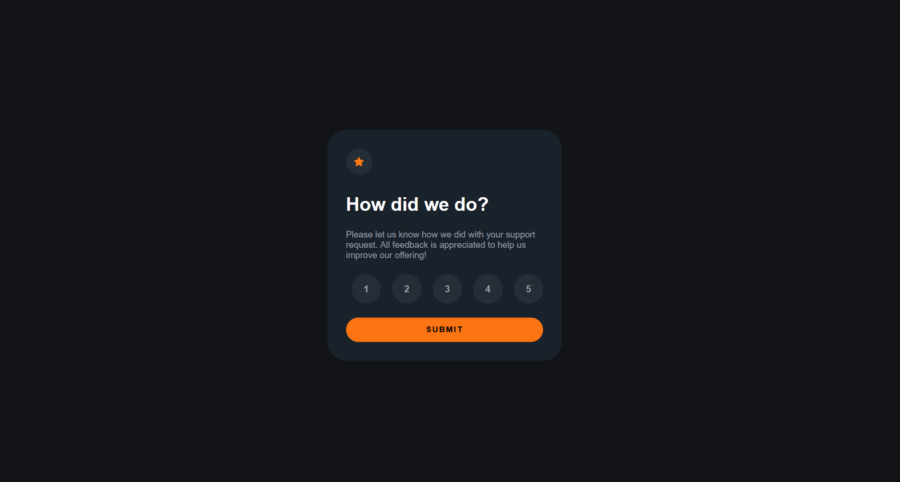
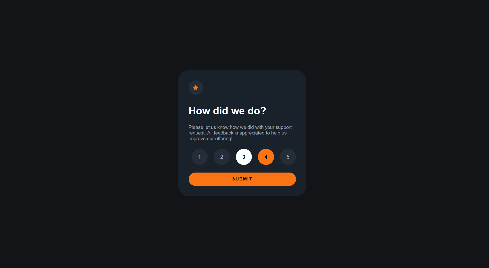
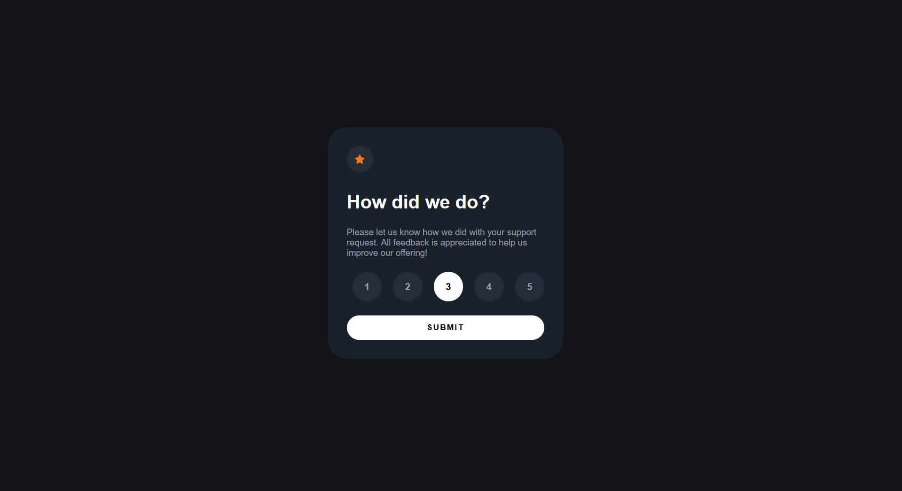

# Frontend Mentor - Interactive Rating Component solution

This is a solution to the [Interactive rating component challenge on Frontend Mentor](https://www.frontendmentor.io/challenges/interactive-rating-component-koxpeBUmI).

## Table of contents

- [Overview](#overview)
    - [The challenge](#the-challenge)
    - [Screenshot](#screenshot)
    - [Links](#links)
- [My process](#my-process)
    - [Built with](#built-with)
    - [What I learned](#what-i-learned)
    - [AI Collaboration](#ai-collaboration)
- [Author](#author)

## Overview

### The challenge

Users should be able to:

- View the optimal layout for the app depending on their device's screen size
- See hover states for all interactive elements on the page
- Select and submit a number rating
- See the "Thank you" card state after submitting a rating

### Screenshot

### Links

- Solution URL: [Add solution URL here](https://your-solution-url.com)
- Live Site URL: [Add live site URL here](https://your-live-site-url.com)

## My process

### Built with

- Semantic HTML5 markup
- CSS custom properties
- Flexbox
- JavaScript

### What I learned

This project was essential to connect my HTML & CSSa knowledge with JavaScript. This was the first time i tried to use JavaScript with this kind of logic.

### AI Collaboration

I worked with Gemini, who acted as a mentor throughout the project.

    Role: Instead of providing direct solutions, the AI provided hints, logic outlines, and engineering "skepticism" to ensure I understood the why behind the code.

    Result: It helped me a lot with brainstorming before directly jumping to code.

## Author

- Frontend Mentor - [@Cankutay3104](https://www.frontendmentor.io/profile/Cankutay3104)
